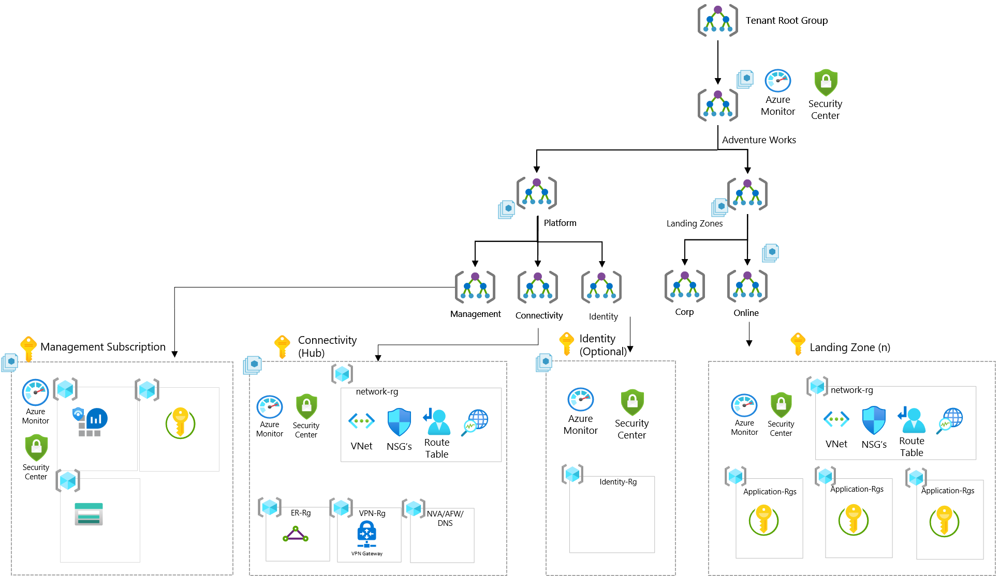

| Enterprise-Scale Design Principles | ARM Template | Scale without refactoring |
|:-------------|:--------------|:--------------|
||   | Yes |

# Deploy Enterprise-Scale with hub and spoke architecture

## Customer profile

This reference implementation is ideal for customers that have started their Enterprise-Scale journey with a Enterprise-Scale foundation implementation and then there is a need to add connectivity on-premises datacenters and branch offices by using a hub and spoke network architecture. This reference implementation is also well suited for customers who want to start with Landing Zones for their net new
deployment/development in Azure by implementing a network architecture based on the hub and spoke model.

## How to evolve from Enterprise-Scale foundation

If customer started with a Enterprise-Scale foundation deployment, and if the business requirements changes over time, such as migration of on-premise applications to Azure that requires hybrid connectivity, you will simply create the **Connectivity** Subscription and place it into the **Platform** Management Group and assign Azure Policy for the hub and spoke network topology.

## Pre-requisites

To deploy this ARM template, your user/service principal must have Owner permission at the Tenant root.
See the following [instructions](https://docs.microsoft.com/en-us/azure/role-based-access-control/elevate-access-global-admin) on how to grant access.

## What will be deployed?

- A scalable Management Group hierarchy aligned to core platform capabilities, allowing you to operationalize at scale using RBAC and Policy
- Azure Policies that will enable autonomy for the platform and the Landing Zones
- An Azure Subscription dedicated for Management, which enables core platform capabilities at scale such as security, auditing, and logging
- An Azure Subscription dedicated for Connectivity, which deploys core networking Resources such as the hub Virtual Network, Azure Firewall, VPN Gateway, Route Tables, among others
- Landing Zone Management Group for corp-connected applications that require hybrid connectivity. This is where you will create your Subscriptions that will host your corp-connected workloads
- Landing Zone Management Group for online applications that will be internet-facing, which doesn't require hybrid connectivity. This is where you will create your Subscriptions that will host your online workloads

